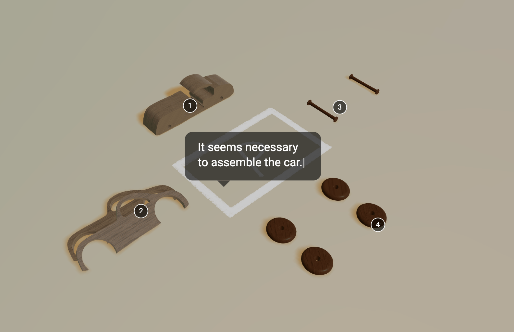
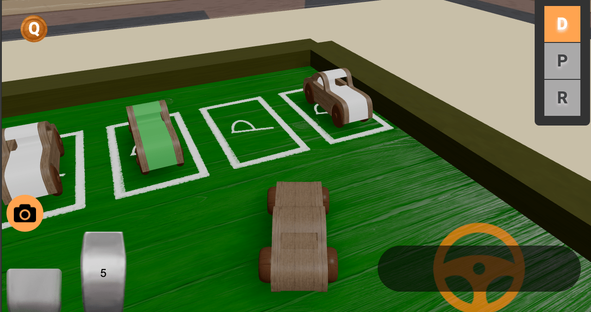
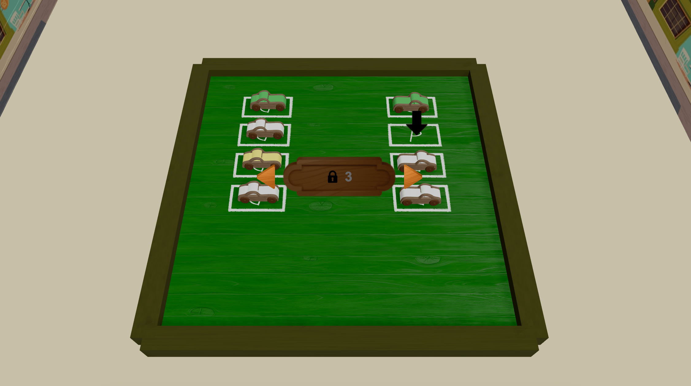
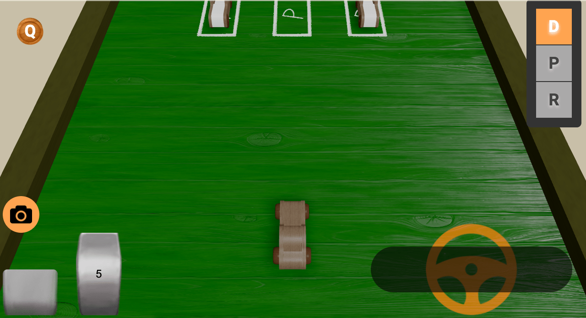
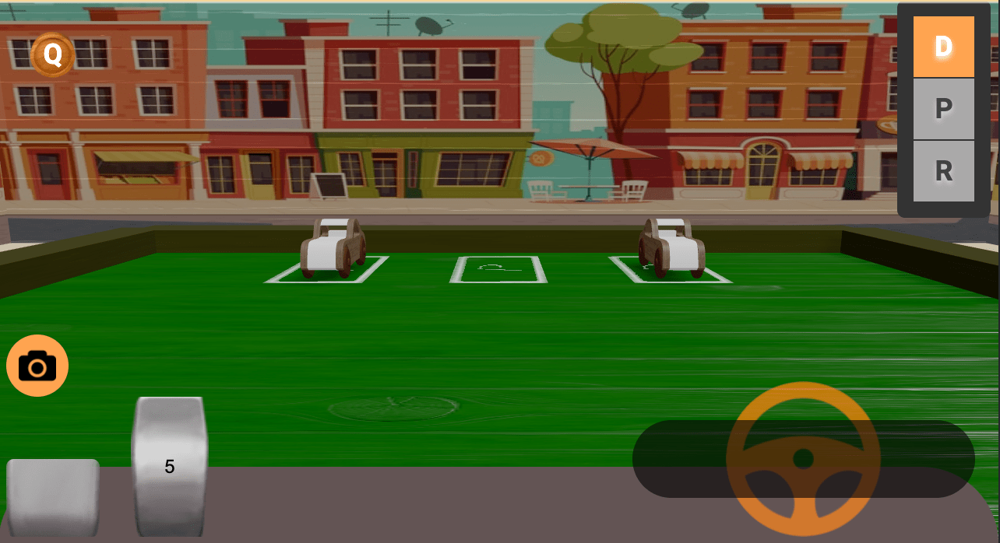
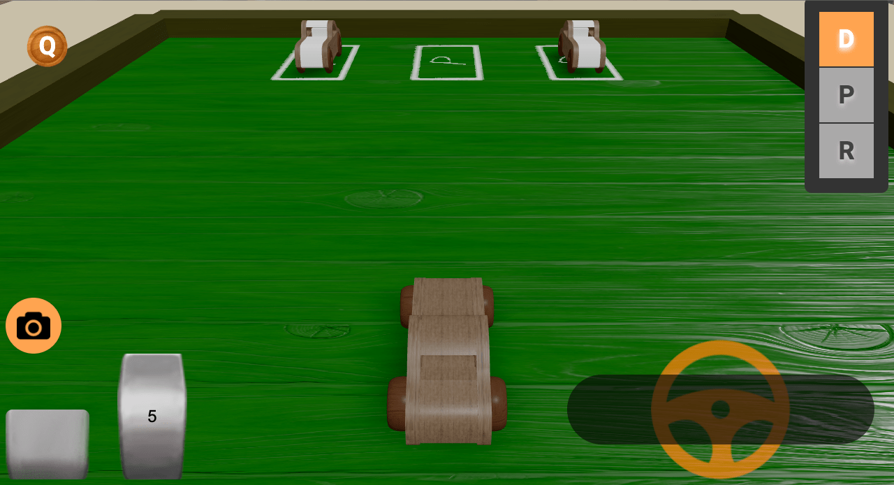

# Driving Practice Game

[Deployment Link](https://car-drive-practice.vercel.app/)

# In-game

# Planning Intentions (Value and Importance of Driving)

## Background

Recently, there has been a decrease in the number of driver's license holders and an increase in reluctance to drive among young people, leading to a gradual decline in the societal importance and value of driving. This trend is influenced by various factors such as population decline, economic burdens, and the convenience of public transportation.

## Intentions

Emphasizing that driving is not merely for personal convenience, but a means to connect people and assist loved ones. Players of the game enhance their driving skills, raise awareness about safe driving, and realize the value of safely transporting their loved ones during the process.

## Messages

- Driving for People: The game underscores that driving is not only for oneself but also for the safety and happiness of others.
- Friendship and Connection: Through driving, players meet their loved ones and emphasize the value of friendship and connection by participating in their lives.
- Emphasis on Safe Driving: While emphasizing the importance of driving, the game also stresses the significance of safe driving. Players acquire safe driving skills and understand the positive impact it has on society as a whole.

# Camera Switch

# Sources of Assistance

- [react-three-next](https://github.com/pmndrs/react-three-next)

# News Source

- [SBS News](https://news.sbs.co.kr/news/endPage.do?news_id=N1007574068)
